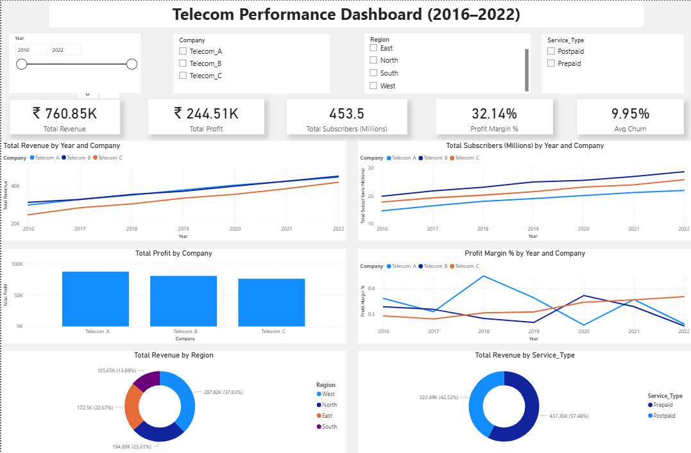

# 📡 Telecom Strategic Performance & Revenue Forecasting Analysis

[](https://www.python.org/)
[](https://powerbi.microsoft.com/)
[](https://scikit-learn.org/)
[](LICENSE)

An end-to-end strategic telecom analytics project combining **Python (Data ETL, Exploratory Data Analysis & Linear Regression Forecasting)** and **Microsoft Power BI (Interactive Executive Dashboard & DAX KPIs)** to evaluate competitive operator performance, regional profitability, and long-term revenue growth.

---

## 📌 Executive Summary & Business Objective

In the highly competitive telecom sector, operators face margin pressure, shifting customer preferences (Prepaid vs. Postpaid), and fluctuating churn rates.

This project delivers an end-to-end analytical framework to:
1. **Analyze Historical Performance (2016–2022)** across 3 major competing operators (`Telecom_A`, `Telecom_B`, `Telecom_C`).
2. **Evaluate Financial Efficiency & Unit Economics** through EBITDA margins, Operating Costs, and ARPU (Average Revenue Per User).
3. **Generate a 5-Year Revenue Forecast (2023–2027)** using linear trend regression to support executive strategic planning.
4. **Deliver an Interactive Power BI Dashboard** for executive decision-making.

---

## 🛠️ Tech Stack & Architecture

- **Analysis & Modeling:** Python 3.x (Spyder IDE)
- **Data Manipulation & ETL:** Pandas, NumPy
- **Data Visualization:** Matplotlib
- **Machine Learning / Forecasting:** Scikit-learn (`LinearRegression`, $R^2$ Score)
- **Business Intelligence & Reporting:** Microsoft Power BI Desktop, DAX (Data Analysis Expressions)

---

## 📊 Key Performance Indicators (KPIs)

| KPI Metric | Definition | Business Importance |
| :--- | :--- | :--- |
| **Revenue ($M)** | Total annual gross earnings from telecom operations | Primary top-line growth indicator |
| **ARPU** | $\frac{\text{Annual Revenue}}{\text{Subscribers}}$ | Measures customer monetization value |
| **EBITDA Margin (%)** | $\frac{\text{Revenue} - \text{Operating Cost}}{\text{Revenue}} \times 100$ | Measures operational profitability & cost discipline |
| **Churn Rate (%)** | Percentage of subscribers discontinuing service | Core indicator of customer retention health |
| **YoY Revenue Growth (%)** | $\frac{\text{Revenue}_t - \text{Revenue}_{t-1}}{\text{Revenue}_{t-1}} \times 100$ | Annual revenue growth velocity |

---

## 📈 Key Strategic Insights

1. **Top-Line Growth vs. Efficiency:**
   - `Telecom_A` consistently generated the highest ARPU and gross revenue, benefiting from strong Postpaid market positioning.
   - `Telecom_C` demonstrated the strongest margin expansion, scaling its EBITDA margin from **29.2%** to over **36.7%** by optimizing operating expenses.
2. **Regional Profit Dynamics:**
   - The **West** and **East** regions generated the highest cumulative profitability, while the **North** region presented higher subscriber acquisition costs.
3. **5-Year Growth Trajectory (Linear Regression):**
   - The predictive model achieved a **strong fit ($R^2 > 98\%$)**, projecting steady top-line growth across all three operators through 2027 based on historical momentum.

---

## 🖥️ Power BI Executive Dashboard

The interactive Power BI dashboard (`Telecom_Performance_Dashboard.pbix`) provides an interactive interface for executive review:



### Core Visualizations:
* **Revenue Trend Analysis (2016–2022):** Multi-line comparative trajectory across operators.
* **Profit by Region:** Bar chart highlighting regional financial contribution.
* **Subscriber & Margin KPIs:** Interactive cards and breakdown by service tier (Prepaid vs. Postpaid).

---

## 📁 Repository Structure

```text
├── TelecomForecast.py                   # Python pipeline (Data Simulation, ETL, EDA & Forecasting)
├── Telecom_Performance_Dashboard.pbix   # Interactive Power BI Dashboard
├── requirements.txt                     # Project dependencies
├── telecom_data.csv                     # Processed dataset with engineered growth KPIs
├── telecom_raw_data.csv                 # Baseline simulated telecom dataset
├── telecom_forecast_data.csv            # 5-Year revenue forecast projections (2023-2027)
├── Dashboard.png                        # Power BI dashboard screenshot
├── Revenuetrend.png                     # Python revenue trend visual
├── ProfitbyRegion.png                   # Python regional profit visual
├── LICENSE                              # MIT License
└── README.md                            # Comprehensive project documentation
```

---

## 🚀 How to Run Locally

### 1. Clone the Repository
```bash
git clone https://github.com/TejalGB/telecom-business-analysis-python-powerbi.git
cd telecom-business-analysis-python-powerbi
```

### 2. Install Dependencies
```bash
pip install -r requirements.txt
```

### 3. Run in Spyder / Terminal
* **Using Spyder IDE:**
  1. Open `TelecomForecast.py` in **Spyder**.
  2. Run the script cell-by-cell using `Shift + Enter` (or `Ctrl + Enter`), or click the **Run File (F5)** button.
* **Using Terminal:**
  ```bash
  python TelecomForecast.py
  ```

### 4. Explore Power BI Dashboard
* Open `Telecom_Performance_Dashboard.pbix` in **Power BI Desktop** to explore the interactive slicers, drilldowns, and visuals.

---

## 👤 Author
- **GitHub:** [@TejalGB](https://github.com/TejalGB)
- **Project:** Telecom Business Analysis (Python & Power BI)
