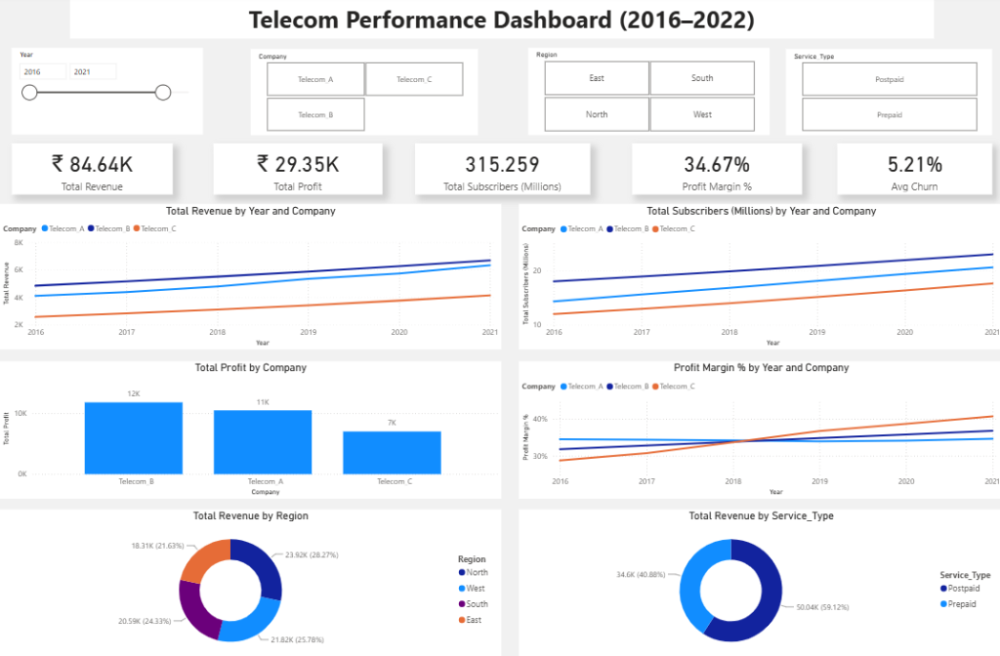

# 📡 Telecom Strategic Performance Analysis & Revenue Forecasting

An end-to-end telecom analytics project combining **Python (Multi-Dimensional Scenario Simulation, ETL, Exploratory Data Analysis & Holdout-Validated Forecasting)** and **Microsoft Power BI (Interactive Executive Dashboard & DAX Modeling)** to evaluate competitive operator performance, regional profitability, customer tier unit economics, and long-term revenue trends.

---

## 📌 Executive Summary & Business Context

In the competitive telecom sector, operators balance subscriber growth with customer quality, shifting customer mix (Prepaid vs. Postpaid), operational cost discipline, and segment-specific churn dynamics.

This project delivers an end-to-end analytical framework designed to:
1. **Analyze Multi-Dimensional Performance (2016–2022)** across 3 competing operators (`Telecom_A`, `Telecom_B`, `Telecom_C`) segmented across **4 geographical regions** (`North`, `South`, `East`, `West`) and **2 service tiers** (`Prepaid`, `Postpaid`).
2. **Evaluate Unit Economics & Financial Health** through Monthly/Annual ARPU (Average Revenue Per User), Operating Costs, and EBITDA margins.
3. **Analyze Churn Dynamics & Segment Risk** across prepaid vs. postpaid subscriber bases.
4. **Deliver a Validated 5-Year Revenue Trend Projection (2023–2027)** with time-based train/test holdout validation.
5. **Provide an Interactive Power BI Executive Dashboard** for stakeholder decision-making.

> **Note on Data & Methodology:** This project utilizes a reproducible, multi-dimensional synthetic dataset modeled with realistic telecom business mechanics (unit economics, tier-specific ARPU, and segment churn behaviors) to demonstrate enterprise data analysis, ETL pipelines, and BI visualization methodologies.

---

## 🛠️ Tech Stack & Architecture

- **Data Processing & Modeling:** Python 3.x (Spyder IDE)
- **Data Engineering & ETL:** Pandas, NumPy
- **Visual Analytics:** Matplotlib
- **Predictive Analytics:** Scikit-learn (`LinearRegression`, Time-Based Train/Test Split)
- **Evaluation Metrics:** Mean Absolute Error (MAE), Root Mean Squared Error (RMSE), Mean Absolute Percentage Error (MAPE)
- **Business Intelligence & Reporting:** Microsoft Power BI Desktop, DAX (Data Analysis Expressions)

---

## 📊 Key Performance Indicators (KPIs) & Data Dictionary

| KPI Metric | Formula / Calculation | Units | Business Significance |
| :--- | :--- | :--- | :--- |
| **Annual Revenue** | `Subscribers (M) * Monthly ARPU ($) * 12` | $ Millions | Top-line business earnings across segment allocations |
| **Monthly ARPU** | `Annual Revenue ($M) / (Subscribers (M) * 12)` | $/Subscriber/Month | Customer monetization rate and plan value |
| **Annual ARPU** | `Annual Revenue ($M) / Subscribers (M)` | $/Subscriber/Year | Annualized customer value per subscription |
| **EBITDA Margin (%)** | `((Revenue - Operating Cost) / Revenue) * 100` | Percentage (%) | Operational profitability and cost discipline |
| **Churn Rate (%)** | Annualized rate of subscriber departures | Percentage (%) | Customer retention health across service tiers |
| **YoY Revenue Growth (%)** | `((Revenue_t - Revenue_t-1) / Revenue_t-1) * 100` | Percentage (%) | Operator revenue momentum year-over-year |

---

## 🔬 Multi-Dimensional Data Grain & Pipeline

The pipeline generates and transforms data at the granular level:
$$\text{Company (3)} \times \text{Year (7: 2016–2022)} \times \text{Region (4)} \times \text{Service Type (2)} = \mathbf{168\text{ Records}}$$

### Realistic Telecom Business Logic Modeled:
* **Postpaid Segment:** Higher plan value (Monthly ARPU: \$28–\$42/mo), lower churn (1.5%–3.5%), and higher operational contribution.
* **Prepaid Segment:** High volume, lower plan value (Monthly ARPU: \$9–\$18/mo), higher turnover/churn (5.0%–9.5%).
* **Regional Distribution:** Weighted across 4 core territories (`North: 28%`, `West: 26%`, `South: 24%`, `East: 22%`).

---

## 📈 Forecasting Methodology & Validation

Rather than relying on in-sample regression fit metrics ($R^2$), the forecasting pipeline employs a **time-based holdout validation** framework:

1. **Training Period (2016–2020):** Historical training baseline (5 years).
2. **Holdout Test Period (2021–2022):** 2-year out-of-sample test period to evaluate prediction error.
3. **Validation Metrics:** Evaluated using Out-of-Sample **MAE**, **RMSE**, and **MAPE** on the holdout test set to ensure realistic trend reliability.
4. **5-Year Projection (2023–2027):** Full historical fit used to model baseline trend projections, saved to `telecom_forecast_data.csv`.

---

## 🖥️ Power BI Executive Dashboard

The Power BI dashboard (`Telecom_Performance_Dashboard.pbix`) ingests the primary processed dataset (`telecom_data.csv`) to deliver executive visibility:



### Core Visualizations & Features:
* **Executive KPI Cards:** Real-time summary of Total Revenue, Profit, Subscribers, Profit Margin %, and Average Churn.
* **Operator Revenue Trajectory:** Multi-year trend line across competing operators.
* **Regional Profitability Breakdown:** Bar chart highlighting regional contribution.
* **Service Tier Composition:** Donut charts illustrating revenue and subscriber distribution by plan type.
* **Interactive Slicers:** Dynamic filtering by Operator, Region, Service Tier, and Year.

---

## 📁 Repository Structure

```text
├── TelecomForecast.py                   # Python pipeline (Simulation, ETL, EDA & Validated Forecasting)
├── Telecom_Performance_Dashboard.pbix   # Power BI Dashboard file (consumes telecom_data.csv)
├── requirements.txt                     # Project Python dependencies
├── telecom_data.csv                     # Primary processed dataset consumed by Power BI (168 rows)
├── telecom_cleaned_data.csv             # Cleaned ETL dataset
├── telecom_raw_data.csv                 # Raw multi-dimensional simulated data
├── telecom_forecast_data.csv            # 5-Year revenue forecast with holdout validation metrics
├── Dashboard.png                        # Executive dashboard visual preview
├── Revenuetrend.png                     # Python exploratory revenue trend chart
├── ProfitbyRegion.png                   # Python exploratory regional profit chart
├── .gitignore                           # Git ignore configurations
└── README.md                            # Comprehensive project documentation
```

---

## 🚀 How to Run Locally

### 1. Clone the Repository
```bash
git clone https://github.com/TejalGB/telecom-business-analysis-python-powerbi.git
cd telecom-business-analysis-python-powerbi
```

### 2. Install Dependencies
```bash
pip install -r requirements.txt
```

### 3. Run in Spyder / Terminal
* **Using Spyder IDE:**
  1. Open `TelecomForecast.py` in **Spyder**.
  2. Run the script cell-by-cell using `Shift + Enter` (or `Ctrl + Enter`), or click the **Run File (F5)** button.
* **Using Terminal:**
  ```bash
  python TelecomForecast.py
  ```

### 4. Open in Power BI Desktop
1. Open `Telecom_Performance_Dashboard.pbix` in **Power BI Desktop**.
2. Click **Refresh** on the Home ribbon to sync the latest data from `telecom_data.csv`.
